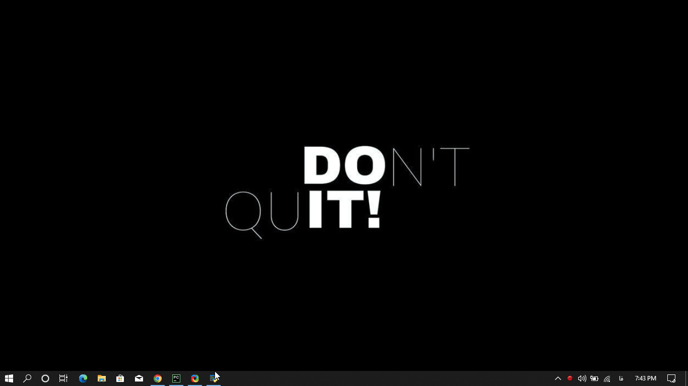
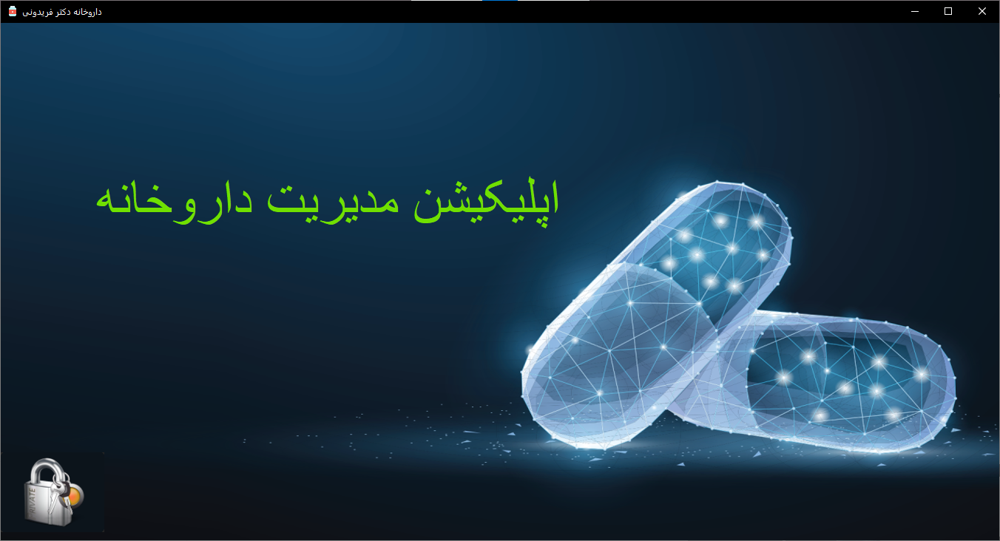
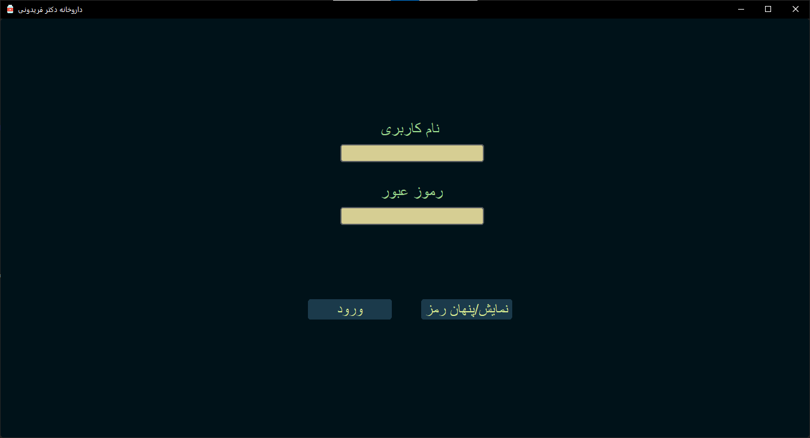
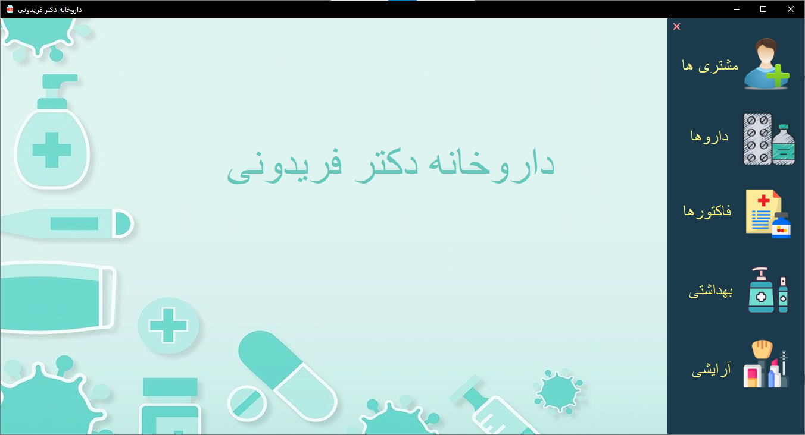
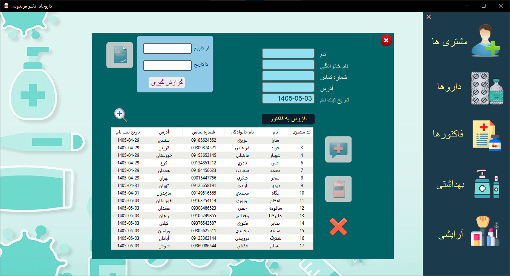
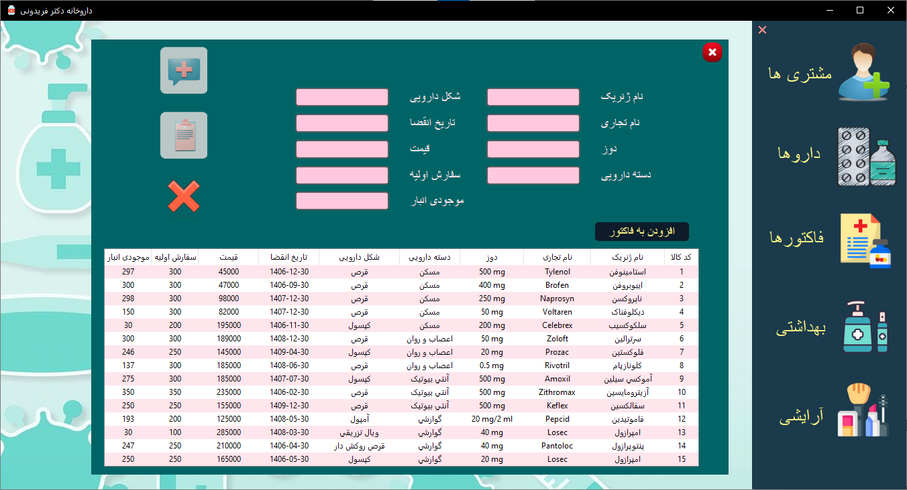
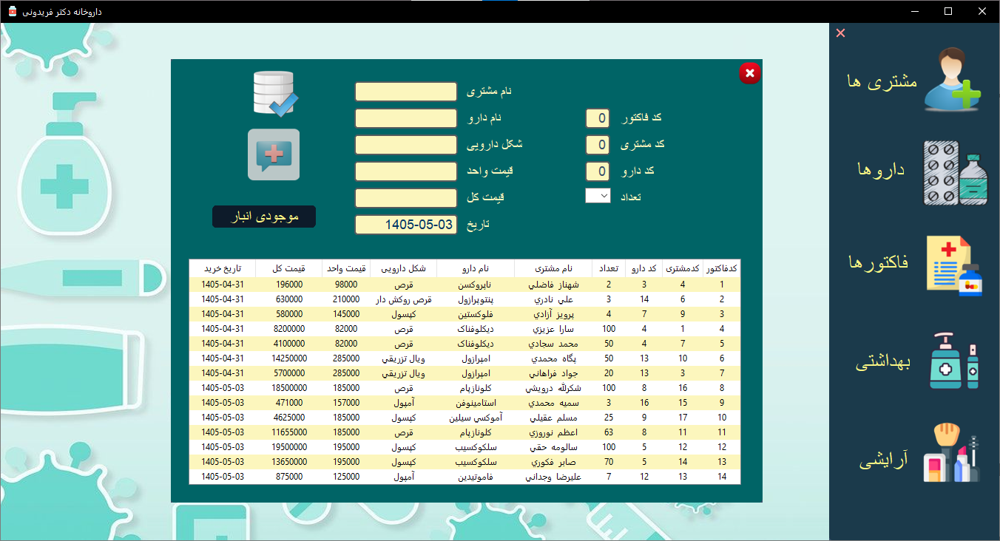
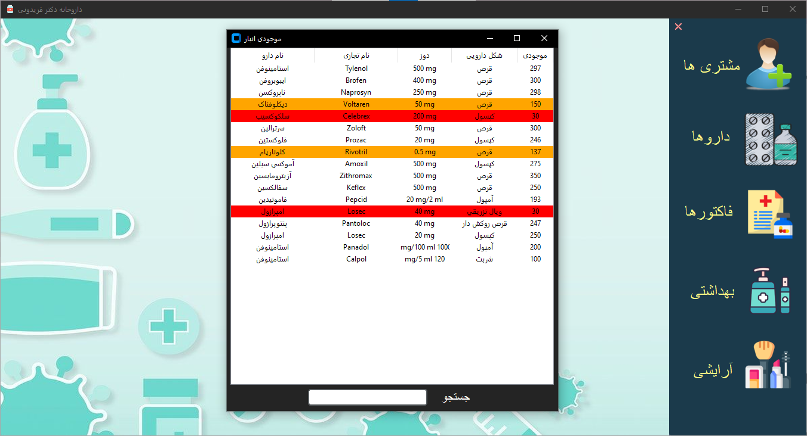

# 💊 PharmaDesk


A desktop pharmacy management system developed with Python for managing pharmacy products, customers, inventory, and sales invoices.

This project was developed to practice desktop application development using Python, layered software architecture, SQLAlchemy for database management, and modern graphical user interface design with CustomTkinter.

---

##  Highlights

- Desktop Pharmacy Management System
- Modern GUI with CustomTkinter
- Layered Architecture (PL / BLL / DAL / BE)
- SQLAlchemy ORM
- SQLite Database
- Persian (Jalali) Calendar Support

---

## Table of Contents

- [Demo](#demo)
- [Screenshots](#screenshots)
- [Features](#features)
- [Architecture](#architecture)
- [Technologies](#technologies)
- [Project Structure](#project-structure)
- [Installation](#installation)
- [Sample Database](#sample-database)
- [Design Decisions](#design-decisions)
- [Future Improvements](#future-improvements)
- [Author](#author)

---


## Demo

<p align="center">
  
</p>

---

## Screenshots

## 🖼 Screenshots

<p align="center">
  
  &nbsp;&nbsp;
  
</p>

<p align="center">
  
  &nbsp;&nbsp;
  
</p>

<p align="center">
  
  &nbsp;&nbsp;
  
</p>

<p align="center">
  
</p>

---

## Features

###  Authentication

- User login system

---

###  Product Management

- Add new products
- Edit product information
- Delete products
- Search products

---

###  Customer Management

- Add new customers
- Edit customer information
- Delete customers
- Search customers

---

###  Inventory Management

- View current inventory
- Monitor product stock

---

###  Invoice Management

- Create sales invoices
- Automatic invoice registration
- Invoice records remain read-only after creation (editing and deletion are intentionally disabled)

---

###  Persian Calendar Support

- Jalali (Persian) date support using **jdatetime**

---

###  User Interface

- Modern desktop interface using CustomTkinter
- Image-based interface
- Custom application icon
- Responsive layout

---

## Architecture

The project is organized using a layered architecture.

```text
Presentation Layer (PL)
          │
          ▼
Business Logic Layer (BLL)
          │
          ▼
Data Access Layer (DAL)
          │
          ▼
Business Entities (BE)
          │
          ▼
SQLite Database
```

This architecture separates the user interface, business rules, data access, and entities, making the project easier to maintain and extend.

---
## Technologies

- Python
- CustomTkinter
- SQLAlchemy
- SQLite
- Pillow (Image Processing)
- jdatetime (Jalali Calendar)

---

## Project Structure

```text
PharmaDesk/
│
├── BE/                    # Business entities
├── BLL/                   # Business logic layer
├── DAL/                   # Data access layer
├── PL/                    # Presentation layer
│
├── assets/
│   ├── images/
│   └── icons/
│
├── docs/
│   ├── screenshots/
│   └── demo.gif
│
├── Darookhaneh.db
├── main.py
├── requirements.txt
├── .gitignore
└── README.md
```

---

## Installation

- Python 3.12+
- Clone the repository

```bash
git clone https://github.com/parisa-asoodeh/PharmaDesk.git
```

Move into the project directory

```bash
cd PharmaDesk
```

Create a virtual environment

```bash
python -m venv .venv
```

Activate the virtual environment

Windows

```bash
.venv\Scripts\activate
```

Linux / macOS

```bash
source .venv/bin/activate
```

Install dependencies

```bash
pip install -r requirements.txt
```

Run the application

```bash
python main.py
```

---

## Sample Database

The repository includes a sample SQLite database (`Darookhaneh.db`) containing demonstration data.

The included database contains only sample data for demonstration purposes. No real or sensitive information is included.


---

## Design Decisions

### Layered Architecture

The application follows a layered architecture (PL, BLL, DAL, BE) to keep responsibilities separated and improve code maintainability.

### SQLite

SQLite was selected because it is lightweight, portable, and requires no additional server installation.

### Read-only Invoices

Invoices cannot be edited or deleted after creation.

This design choice helps preserve transaction records and avoids accidental modifications.

### CustomTkinter

CustomTkinter was chosen to provide a modern desktop user interface while keeping the application entirely Python-based.

---

## Future Improvements

Potential future enhancements include:

- Barcode support
- Inventory alerts
- Sales reports
- Purchase management
- Role-based user permissions
- Password hashing
- Database migration to PostgreSQL or SQL Server
- Unit tests

---

## Author

**Parisa Asoodeh**

Python Developer

GitHub: <https://github.com/parisa-asoodeh>

---

⭐ If you found this project useful, consider giving it a star.